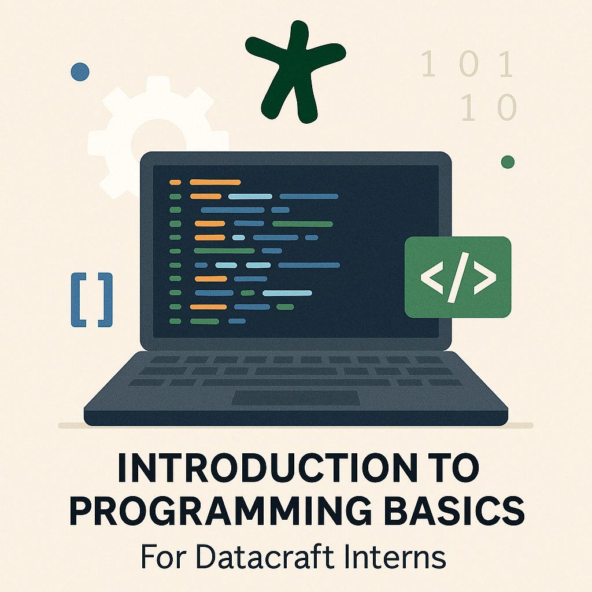

# Accueil Stagiaire

Ce dépôt a pour but d'accueillir et de donner les bonnes pratiques aux nouveaux stagiaires de [datacraft](https://datacraft.paris/).

# Étapes

1. [Mise en place de l'environnement](./environment_setup.md)
2. [Bonnes pratiques de code](./code_best_practices.md)
3. [Git & GitHub](./git.md)
4. [Programmation Orientée Objet](./oop.md)

---