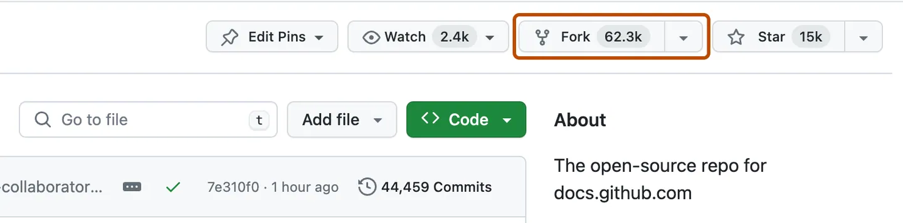

# Guide Intégration Continue

Ce document explique comment utiliser l'intégration continue (CI) avec GitHub Action permettant d'automatiser des tests avant de pouvoir lancer une fusion qui garantit la fonctionnabilité du code.

---

## 1. Qu'est-ce que GitHub Action et la CI ?

**GitHub Action** : Plateforme d’automatisation fournie par GitHub qui permet de créer des workflows (suite de tâches ou opérations) déclenchés par des requêtes GitHub (push, pull request, etc.) pour exécuter des scripts, tester le code, compiler, packager, déployer, etc.

**CI** : Pratique de développement qui consiste à tester automatiquement le code à chaque fois qu’un développeur pousse une modification sur un dépôt (via un push ou une pull request). L’objectif est de détecter les erreurs dès qu’elles sont introduites, s'assurer que le code reste fonctionnel et de qualité et d'automatiser les vérifications répétitives (tests, lint, build…).

En pratique, la CI permet essentiellement de :
 - Lancer des tests automatiquement dès le `push` ou le `pull request`.
 - Vérifier tous les changements afin de ne pas casser la branche principale et ne pas perdre le travail de ses collaborateurs.
 - Empêcher de fusionner une branche au `main` tant que les tests échouent.

Par exemple, si un utilisateur fait un fork sur un projet existant pour y apporter ses modifications puis fait un pull-request, la CI vérifie si son projet cloné est conforme. Ainsi, l'auteur du projet original sait immédiatement si il est judicieux de rejeter ses modifications lorsque la CI n'est pas passée correctement.

---

## 2. Mise en place d'un CI

Avec GitHub, la CI se configure par le biais d'un fichier `.yaml` au sein d'un répertoire précis à la racine du projet qui est le suivant :
```
.github/workflows/<nom_de_la_ci>.yml
```
**Disclaimer**: Les "tabulations" dans un fichier `.yaml` sont impérativement **2 espaces** et non des "vraies" tabulations ou 4 espaces.

Un fichier CI se décompose en plusieurs parties dont les principales qu'on utilisera sont :
 - `name` : Nom de la CI
 - `permissions` : Champ contrôlant ce que le workflow peut faire sur le dépôt
 - `on` : Évènements déclanchant la CI
 - `jobs` :  Tâches réalisées après déclanchement

### En-tête `name` et `permissions`
Ce sont les premières lignes du fichier CI. On définit en premier le nom de la CI puis ses permissions.

Au sein des permissions, on peut accorder des droits pour ces différentes permissions :
| Permission      | Description                                        |
| --------------- | -------------------------------------------------- |
| `contents`      | Lire/écrire le contenu du dépôt (ex: push, commit) |
| `actions`       | Gérer les workflows (démarrer, annuler...)         |
| `checks`        | Créer/modifier des checks de statut                |
| `deployments`   | Créer des déploiements                             |
| `issues`        | Lire/écrire des issues                             |
| `pull-requests` | Lire/écrire des pull requests                      |
| `packages`      | Accéder aux GitHub Packages                        |
| `statuses`      | Créer/modifier des statuts de commit               |

Chaque permission peut prendre 3 valeurs différentes :
 - `none` : Aucun droit
 - `read` : Lecture seule
 - `write` : Lecture + écriture

 Si on omet une permission, ou bien tout simplement qu'on ne précise aucune permission dans le fichier CI, la valeur par défault leur est accordée (`read`).

 Exemple:
 ```
 permissions:
  contents: write
  pull-requests: write
  actions: read
```

### Déclancheurs `on`
Ce sont les commandes git qui vont annoncer qu'il faut lancer les tâches à réaliser au sein du fichier CI. La syntaxe est la suivante pour des évènements standards :
```
on:
  <commande git>:
    branches: [<branche>]
  <commande git>:
    branches: [<branche>]
  ...
```

Exemple:
```
on:
  push:
    branches: [main]
  pull_request:
    branches: [main]
```

### Tâches `jobs`
Le champ `jobs` indique ce qu'on souhaite faire une fois qu'un `push` ou un `pull-request` est lancé. La syntaxe classique est la suivante:
```
jobs:
  <job>:
    name: <nom_job>
    <option>: <valeur_option>
    steps:
      - name: <nom_etape1>
      ...

      - name: <nom_etape2>
      ...

      etc.
```

Les options possibles et les plus utiles d'un job sont:
 - `runs-on`: le système d’exploitation (ubuntu-latest, windows-latest, macos-latest)
 - `needs`: dépendances entre jobs
 - `strategy`: tests sur plusieurs versions de Python/Node/etc.
 - `timeout-minutes`: pour limiter la durée
 - `continue-on-error`: pour ne pas faire échouer un job même s’il échoue

Chaque job contient une clé `steps` qui décrit étape par étape ce que le job fait. Chaque étape est spécifique à si on souhaite exécuter une commande shell, appeler une action GitHub, définir des variables d'environnement, récupérer du code, installer des dépendances, etc. L'écriture de ses étapes diffèrent légèrement. Les plus utiles sont les suivantes (avec exemple):

#### Appeler une action GitHub
```
steps:
  - name: Checkout repository
    uses: actions/checkout@v4
```
#### Passer des paramètres à une action GitHub
```
steps:
  - name: Setup Python
    uses: actions/setup-python@v5
    with:
      python-version-file: .python-version
```

#### Exécuter une commande
```
steps:
  - name: Lancer un script Python
    run: python scripts/train.py
```

#### Définir une variable d'environnement
```
steps:
  - name: Install Python dependencies
    run: uv sync --locked --dev
    env:
      UV_PROJECT_ENVIRONMENT: .venv
```
---

## 3. Exemple complet de CI
```
name: CI
permissions:
  contents: read
  actions: read

on:
  push:
    branches: [main]
  pull_request:
    branches: [main]

jobs:
  pre-commit:
    name: Pre-commit Checks
    runs-on: ubuntu-latest
    steps:
      - name: Checkout repository
        uses: actions/checkout@v4

      - name: Setup uv
        uses: astral-sh/setup-uv@v5

      - name: Setup Python
        uses: actions/setup-python@v5
        with:
          python-version-file: .python-version

      - name: Install Python dependencies
        run: uv sync --locked --dev
        env:
          UV_PROJECT_ENVIRONMENT: .venv

      - name: Run pre-commit
        uses: pre-commit/action@v3.0.1
```
D'autres exemples sont présents en annexe.

---

## Mise en pratique

Créez une copie de ce dépôt git à l'aide d'un fork sur la page GitHub :


Et cliquez sur `Create fork`.

À partir de cette copie, on peut apporter toutes les modifications que l'on veut sans affecter le projet original.

On va maintenant tester avec un fichier CI qu'on nomera `ci.yaml` placé dans le projet de la manière suivante:
```
.github/workflow/ci.yaml
```

Copiez dans `ci.yaml` le code de la CI exemple précédent. On va tester en appliquant un commit sur un fichier mal formaté en ne vérifiant pas les exigeances de black et ruff.


---
## Annexe
 - [Continuous Integration](https://en.wikipedia.org/wiki/Continuous_integration)
 - [Continuous Integration with GitHub Action](https://docs.github.com/en/actions/concepts/overview/about-continuous-integration-with-github-actions)
 - [Exemples de CI (GitHub)](https://github.com/actions/starter-workflows/tree/main/ci)