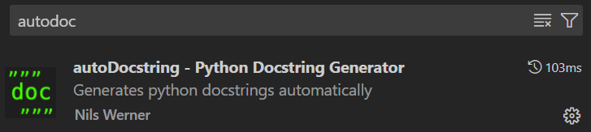
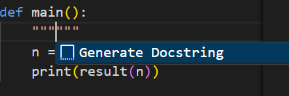
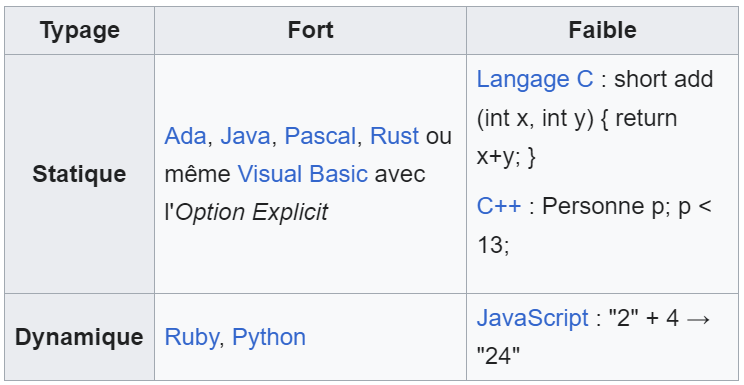

# Structurer son code 

## 🗣️ Conventions et bonnes pratiques
### 8️⃣ PEP 8

PEP 8 est un document officiel de Python, intitulé "Style Guide for Python Code" (Guide de style pour le code Python). 

Il définit un ensemble de conventions que les développeurs Python sont encouragés à suivre pour écrire du code lisible et cohérent. Publié par Guido van Rossum et Barry Warsaw, PEP 8 est l'une des références les plus importantes pour le style de codage en Python.

PEP 8 est essentiel pour plusieurs raisons :

- Lisibilité du code : En suivant une convention de style cohérente, le code devient plus facile à lire et à comprendre, non seulement par l'auteur, mais aussi par d'autres développeurs.
- Maintenance : Un code conforme à PEP 8 est plus facile à maintenir. Lorsque le style est uniforme, il est plus facile de trouver et de corriger des erreurs, ou de mettre à jour le code.
- Collaboration : Dans les projets collaboratifs, suivre PEP 8 permet à tous les développeurs de travailler ensemble plus efficacement, car le style du code est homogène.

Passons en revue les principales recommandations de PEP 8 :

#### ▶️ Imports

Regrouper les importations au début du fichier et les organiser en trois sections : importations de la bibliothèque standard, importations de bibliothèques tierces, et importations spécifiques au projet.

        # imports standards
        import os
        import sys

        import numpy as np
        import pandas as pd

        # imports spécifiques au projet
        from my_project import my_module

Éviter les importations globales (utiliser import module plutôt que from module import *), car elles peuvent rendre le code ambigu.

        # Correct
        import math

        # Incorrect
        from math import *

#### ◻️ Indentation
Utiliser 4 espaces par niveau d'indentation. Ne pas utiliser de tabulations. Cela garantit une lisibilité claire du code et évite les erreurs d'indentation.

#### 📏 Longueur des lignes
Limiter la longueur des lignes à 79 caractères. Cette limite rend le code plus lisible, surtout sur des terminaux ou des éditeurs de texte avec des fenêtres étroites. Pour le code, 79 caractères est la norme ; pour les commentaires et les docstrings, c'est 72 caractères.

#### 🔳 Espaces
Placer correctement les espaces.

- Autour des opérateurs : Il est recommandé d'utiliser un espace autour des opérateurs mathématiques et des opérateurs d'affectation, mais pas à l'intérieur des parenthèses, des crochets ou des accolades.

- Après les virgules, les deux-points et les points-virgules : Ajouter un espace après ces caractères pour améliorer la lisibilité.

#### 🇬🇧 Langue de codage

Coder en anglais.

#### 🏷️ Convention de nommage
PEP 8 définit des conventions de nommage pour les différentes entités du code Python :

- **Fonctions et variables** : Utiliser le `snake_case`, c'est-à-dire des mots en minuscules séparés par des underscores.

        def my_function():
            my_variable = 10

- **Classes** : Utiliser le `PascalCase`, où chaque mot commence par une majuscule et les mots sont collés ensemble.

        class MyClassName:
            pass

- **Constantes** : Utiliser le `SCREAMING_SNAKE_CASE`, c'est-à-dire des mots en majuscules séparés par des underscores. Ces variables sont souvent définies dans un fichier `.env` notamment quand il s'agit de clé API/TOKEN ou toutes autres variables à protéger.

        MAX_SIZE = 100

### 🗂️ Docstring

Le mot docstring est un raccourci pour DOCumentation STRINGs et est un élément essentiel de PEP 8.

Utiliser des docstrings pour documenter les modules, classes et fonctions. Les docstrings permettent de décrire ce que fait un module, une classe ou une fonction, comment l'utiliser, et d'expliquer les paramètres et les valeurs de retour.

        def my_function(param1, param2):
            """
            Résumé de la fonction.

            Arguments:
            param1 -- première description du paramètre
            param2 -- deuxième description du paramètre

            Return:
            Retourne une valeur traitée.
            """
            return param1 + param2

Dans VSCode, il existe une extension pour se faire aider dans cette démarche de documentation :

Une fois téléchargé, le principe est simple : dans votre fonction vous écrivez 3 fois les guillemets de la `touche 3`.

Conseil: aller dans les paramètres de l'extension et définir le format sur `numpy`. C'est le format le plus standard utilisé en Data Science.

Si tout se passe bien, vous devez normalement voir ceci : 

On a juste a appuyé sur la touche `entrée` pour accéder à la doc de notre fonction et la compléter à notre convenance.

### 🛠️ Outils pour appliquer PEP 8

Plusieurs outils peuvent aider à vérifier et à appliquer les règles de PEP 8 dans votre code Python :

- `pycodestyle` : Un utilitaire de vérification de style Python qui examine le code pour s'assurer qu'il suit PEP 8.
- `flake8` : Un outil combinant pycodestyle, pyflakes (pour la vérification des erreurs) et mccabe (pour vérifier la complexité du code).
- `black` : Un formateur de code Python qui reformate automatiquement le code pour qu'il respecte PEP 8.
- `pylint` : Un autre outil d'analyse statique qui peut vérifier la conformité à PEP 8, parmi d'autres vérifications de qualité du code.
- `ruff` : Un outil d'analyse statique rapide et moderne pour Python, qui vise à remplacer ou compléter des outils comme flake8, pycodestyle, pyflakes et même black. Ruff est conçu pour être extrêmement performant, en offrant des vérifications de style et de qualité de code avec une latence minimale tout en étant capable de s'intégrer avec des workflows existants.
- `trunk` : Un gestionnaire d'intégration et de développement de projets qui permet de centraliser et de gérer divers outils d'analyse statique, de formatage et de vérification de code, comme ruff, black, et pylint. Trunk facilite la configuration et l'exécution de ces outils au sein d'un projet, en les combinant de manière cohérente et simplifiée pour améliorer l'efficacité du développement.

On recommande via trunk.

## Le Typing

Le typing en programmation, aussi appelé typage, est un concept fondamental qui régit comment les données sont classifiées et gérées par notre code.

A MODIFIER permets de structurer les variables et les fonctions

C'est une notion clé dans la collaboration et le codage car elle permet de se faire comprendre de tous et de réaliser des codes accessibles pour tous (= les initiés).

C'est une couche supplémentaire de documentation et de bonnes pratiques.

### Les types

Les types de base incluent généralement :
- Numériques : entiers (int), réels (float), décimaux (decimal).
- Textuels : caractères (char), chaînes de caractères (string).
- Booléens : valeurs booléennes (True, False).
- Tableaux : listes ou tableaux d'éléments de type homogène (list, array).
- Objets : instances de classes avec des attributs et méthodes.

### Typage statique VS Typage dynamique

#### 🗿 Typage statique

Le typage statique signifie que le type de chaque variable est déterminé au moment de la compilation. Ce type ne peut pas changer pendant l'exécution du programme. Les langages avec un typage statique sont souvent plus stricts et permettent de détecter des erreurs dès la compilation. Exemples : C, C++, Java.

##### ➕ Avantages :

- Sécurité accrue : les erreurs de type sont détectées tôt.
- Optimisation : le compilateur peut optimiser le code grâce à la connaissance des types.
- Auto-complétion améliorée dans les IDE grâce à la connaissance des types.

##### ➖ Inconvénients :

- Rigidité : le développeur doit explicitement déclarer les types.
- Flexibilité réduite pour certaines opérations dynamiques.

#### 💫 Typage dynamique

Le typage dynamique signifie que le type de la variable est déterminé au moment de l'exécution. Une variable peut changer de type au cours du programme. Exemples : Python, JavaScript, Ruby.

##### ➕ Avantages :

- Flexibilité : les variables peuvent changer de type.
- Code plus concis : pas besoin de déclarer explicitement les types.

##### ➖ Inconvénients :

- Moins de sécurité : les erreurs de type apparaissent à l'exécution.
- Moins performant : l'interprétation des types à l'exécution peut être coûteuse.

### Typage fort VS Typage faible

#### 💪 Typage fort

Un langage à typage fort impose des règles strictes sur les opérations entre différents types de données. Une conversion explicite est souvent nécessaire pour effectuer des opérations entre types incompatibles.

Exemple (Python):

    x = "5"
    y = 10
    z = x + y  # Erreur de type, il faut convertir `x` en int

#### 🪫 Typage faible 

Un langage à typage faible permet des conversions implicites entre types sans intervention explicite du programmeur. Cela peut conduire à des comportements inattendus.

Exemple (Java):

    x = "5"
    y = 10
    z = x + y  // Résultat: "510" (concaténation)

### 🛠️ Outils pour le typing 

Un type checker est un outil ou un processus qui vérifie la cohérence des types de données dans le code source d'un programme. Dans les langages de programmation statiquement typés, les types sont explicitement définis et le compilateur vérifie leur cohérence avant l'exécution du programme. Cependant, dans les langages dynamiquement typés comme Python, les types ne sont généralement pas spécifiés explicitement, ce qui peut conduire à des erreurs difficiles à détecter avant l'exécution.

L'un des plus connus est `mypy`. C'est un type checker statique pour Python. Il permet aux développeurs de spécifier des annotations de type dans leur code Python, ce qui améliore la lisibilité du code et aide à détecter des erreurs potentielles avant l'exécution. Mypy analyse le code en utilisant ces annotations pour vérifier que les types sont utilisés de manière cohérente.

### 📓 Récapitulatif 
Voici donc un tableau récapitulatif des typages :

Tout ceci va être mis en pratique dans l'atelier `typing`.

## 📑 Conclusion

Même si le typing et la docstring peuvent être repoussants au départ et donner une impression de surcharger le code, ils sont en fait des éléments essentiels pour se faire comprendre de tous, favoriser une bonne collaboration entre collègues codeurs et permettre une meilleure communication. 

Il est donc primordial d'intégrer ses éléments à son codage dès le départ.s

## 🫵 A vous de jouer

Parce qu'il n'y a rien de mieux pour apprendre l'informatique que de coder par soi-même, vous retrouverez dans le dossier `typing_exercise` un fichier python `exemple_typing.py` qui vous permettra de vous familiariser avec cette pratique.

Votre objectif: typer et documenter les différentes fonctions écrites.

N'hésitez pas à essayer de coder une fonction, de la typer puis de la montrer à votre tuteur. Une correction est également disponible.

Bon typing à tous !

## ℹ️ Source 

- [PEP8](https://peps.python.org/pep-0008/)

- [Typage Fort](https://fr.wikipedia.org/wiki/Typage_fort)

- [Différences de typages](https://www.zdnet.fr/lexique-it/le-langage-type-fort-ou-faible-interprete-ou-compile-une-definition-39926151.htm)

- [Bonnes pratiques python](https://www.carnets.info/python/pep8/)

- [Guides pratique](https://medium.com/@roy.bellot/guide-pratique-pour-le-nommage-de-ses-variables-b86a2d69c9e0)

- [How to type](https://www.how-to-type.com/)