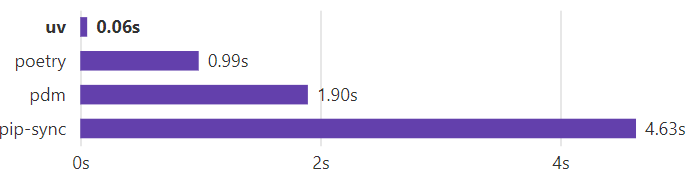

# Mettre en place son environnement de travail


Dans ce guide on va voir comment :
- Mettre en place son environnement Linux 
- Mettre en place les différents outils 
- Mettre en pratique les commandes importantes

# 📚 Installation (tout exécuter en admin)

## Etape 1 (windows uniquement): Installer WSL via le powershell 
        wsl --install

Cela permet d’installer une plateforme de machine virtuelle, un sous-système Windows pour Linux et Ubuntu. (Ne pas fermer la console)

Puis on redémarre son PC.

Au redémarrage, lancer powershell et taper:
`wsl --install -d Ubuntu-24.04`

/!\ Si cette commande ne fonctionne pas, essayer d'abord: `wsl --shutdown` avant de réessayer `wsl --install -d Ubuntu-24.04`

Ensuite, on entre simplement notre prénom et un mdp **que l'on est sûr de pas perdre**!

## Etape 2 : [Installez uv](https://github.com/astral-sh/uv)



Ouvrir un terminal wsl.

Il suffit ensuite de taper la commande :

        curl -LsSf https://astral.sh/uv/install.sh | sh

Suivie de la commande

        source '$HOME/.local/bin/env'

(si l'erreur "No such file or directory" s'affiche, executer la commande suivante et ressayer :
```
curl --proto '=https' --tlsv1.2 -sSf https://sh.rustup.rs | sh
```
)

Pour installer n'importe quel module python, on prendra l'habitude de taper : 

        uv add module_python

Le lien envoie vers la documentation (n'hésitez pas à la consulter).

## Etape 3 : Installer VSCode

        sudo apt install code --classic

Sur windows, il faut également télécharger la version de bureau sur le site: https://code.visualstudio.com/

Puis dans la section `Extensions`, installez quelques extensions très utiles pour la suite:

- Python
- Jupyter
- Remote - SSH (obligatoire pour Windows)
- WSL (obligatoire pour Windows)
- autoDocstring
- Trunk

## Etape 4 : Installer Python

        uv python install 3.12

## Etape 5 (Optionnel) : Installer l'autosuggestion [zsh/ohmyzsh](https://rdr-it.io/ameliorer-son-terminal-avec-zsh-sur-ubuntu-debian/) terminal

        sudo apt install zsh
        sh -c "$(curl -fsSL https://raw.github.com/ohmyzsh/ohmyzsh/master/tools/install.sh)"

Ajout des auto-suggestions

        git clone https://github.com/zsh-users/zsh-autosuggestions ~/.zsh/zsh-autosuggestions
        echo "source ~/.zsh/zsh-autosuggestions/zsh-autosuggestions.zsh" ~/.zshrc
Puis redémarrer le terminal

        git clone https://github.com/zsh-users/zsh-syntax-highlighting.git ~/.zsh/zsh-syntax-highlighting
        echo "source ~/.zsh/zsh-syntax-highlighting/zsh-syntax-highlighting.zsh"  ~/.zshrc
Puis redémarrer le terminal

        git clone https://github.com/zsh-users/zsh-autosuggestions ~/.oh-my-zsh/custom/plugins/zsh-autosuggestions
        git clone https://github.com/zsh-users/zsh-syntax-highlighting.git ~/.oh-my-zsh/custom/plugins/zsh-syntax-highlighting


        vim ~/.zshrc (permet de gérer toutes les dépendances et lien avec bash)

Chercher la ligne contenant (git) et ajouter, en tapant sur la touche `i` (insert):

        zsh-autosuggestions  zsh-syntax-highlighting


# 📚 Les commandes et bonnes pratiques linux

## Création de ses propres alias quand on est amené à taper souvent les mêmes commandes : 

        vim .bashrc ou/zshrc #pour créer mes alias
        i (insert)
        alias mon_alias='la commande bash'
        esc (echap)
        :q #pour quitter simplement
        : wq # svg des modifs 
        Puis relancer le termianl ou faire source $HOME/.bashrc ou/zshrc

## Les classiques:

        ls # pour voir tout les dossiers du repertoire courant
        cd nom_repertoire # pour accéder au repertoire souhaiter
        cd - # pour revenir au user
        cd .. # pour remonter d'un dossier 
        cd / # pour revenir à la racine
        mkdir nom_dossier_a_creer # pour créer un dossier 
        clear # nettoyer l'historique de commandes
        pwd # pour afficher le chemin du répertoire dans lequel on se trouve
        ________________________________
        sudo # pour les installations importantes avec les droits admin
        # Demande toujours un mdp
        exemple : sudo apt install lib 
pour installer le package `lib`

        __________________________________

        rm fichier # pour supprimer un fichier du dossier
        rm -r # pour supprimer un dossier et tout ce qu'il contient.
        rm -rf dossier ; -f signifie `force`, pour forcer la suppression
        cp path/to/file folder # pour copier un fichier dans un dossier
        mv previous/path new/path # permet de déplacer ou de renommer des fichiers et des dossiers


        git clone url_du_projet_à_cloner # Récupérer l'entièreté d'un repo 
        exemple : git clone https://github.com/vienneraphael/scalene-codecarbon-workshop


`CTRL+%` pour ouvrir une console linux directement dans vs code

sur mac: 
```
CTRL + ` 
```

        code . # pour lancer vs code à partir du répertoire dans lequel on se trouve


## Créer un environnement virtuel de travail 

avec uv: `uv venv` ou `uv sync`

si on a fait `uv venv` il faut activer l'environnement: `source .venv/bin/activate` 

## Si une commande n'est plus reconnue 
    #Dans le powershell
    wsl --shutdown
    #Puis dans le powershell
    wsl
    #Revenir dans le terminal linux  


## Pour créer une clé ssh
    # exemple pour générez une clef ssh sur windows ou linux 
    ssh-keygen -t rsa -b 4096 -C "votre_adresse_mail"
    cat .ssh/id_rsa_datacraft.pub

puis, copier-coller cette clé et l'ajouter sur github.

## Pour obtenir sa clé ssh  
    cat .ssh/id_rsa.pub

# Source : 

https://juliend.github.io/linux-cheatsheet/
