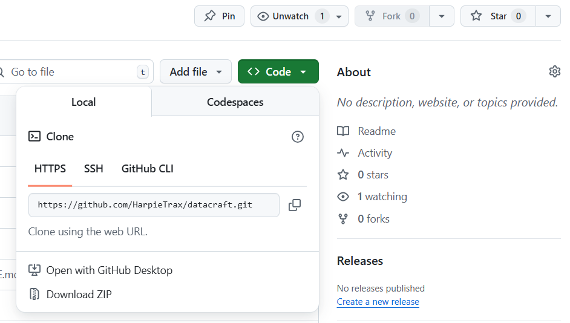

# 📖 Guide Git & GitHub 

Ce document explique les bases de **Git** et **GitHub**, leurs objectifs, les bonnes pratiques, les commandes essentielles et un workflow type. Parfait pour débuter et structurer son travail en développement.

---

## 📌 Qu'est-ce que Git et GitHub ?

- **Git** : logiciel de gestion de versions décentralisé. Il permet de suivre l'évolution d’un projet, collaborer et gérer plusieurs versions du code.
- **GitHub** : plateforme en ligne pour héberger des dépôts Git, collaborer en équipe et versionner le code à distance.

---

## 🎯 Pourquoi utiliser Git et GitHub ?

- Sauvegarder les différentes versions du projet.
- Collaborer à plusieurs sans écraser le travail des autres.
- Travailler sur des fonctionnalités séparées via les branches.
- Publier son code et le partager facilement.

## 🛠️ Installation et configuration de Git sous WSL et Visual Studio Code

Avant de commencer à utiliser Git et GitHub, voici comment l’installer et le configurer correctement sous **WSL (Windows Subsystem for Linux)**, et l’utiliser depuis **Visual Studio Code**.

---

### 📥 1. Installer Git sous WSL

Dans ton terminal WSL (Ubuntu, Debian...) :

```bash
sudo apt update
sudo apt install git
```

Vérifie ensuite l'installation avec :

```bash
git --version
```

Si la version s'affiche, Git est bien installé ✅.

---

### 🔧 2. Configurer Git pour la première fois

Indique ton nom et ton adresse email (ils apparaîtront dans l’historique des commits) :

```bash
git config --global user.name "Ton Nom"
git config --global user.email "tonemail@example.com"
```
Conseil : utilisez votre compte git personnel (adresse mail personnel) si vous en avez déjà un.

Pour vérifier la configuration :

```bash
git config --list
```
Voici la section complète à ajouter dans ton README pour configurer la clé SSH avec GitHub, prête à être copiée :

---

### 🔑 Configurer une clé SSH pour GitHub

1. **Générer une clé SSH :**

   Si tu n'as pas encore de clé SSH, tu peux en générer une en exécutant la commande suivante dans ton terminal :

   ```bash
   ssh-keygen -t rsa -b 4096 -C "tonemail@example.com"
   ```

   Remplace `tonemail@example.com` par ton adresse email GitHub. Ensuite, appuie sur **Entrée** pour accepter l'emplacement par défaut pour la clé. Si tu souhaites, tu peux également définir un mot de passe pour ajouter un niveau de sécurité supplémentaire.

2. **Ajouter la clé SSH à l'agent SSH :**

   Après avoir généré la clé SSH, il faut l'ajouter à l'agent SSH pour pouvoir l'utiliser automatiquement. Exécute les commandes suivantes :

   ```bash
   eval "$(ssh-agent -s)"
   ```

   Puis, ajoute la clé privée à l'agent SSH :

   ```bash
   ssh-add ~/.ssh/id_rsa
   ```

3. **Copier la clé publique :**

   Pour copier ta clé publique, exécute la commande suivante :

   ```bash
   cat ~/.ssh/id_rsa.pub
   ```

   Cela affichera ta clé publique. Sélectionne et copie le texte complet qui commence par `ssh-rsa` et finit par ton email.

4. **Ajouter la clé publique à GitHub :**

   Maintenant, il faut ajouter la clé publique à ton compte GitHub. Suis ces étapes :
   
   - Ouvre GitHub dans ton navigateur et connecte-toi à ton compte.
   - Va dans **Settings** (paramètres) via l'icône en haut à droite de la page.
   - Dans le menu de gauche, sélectionne **SSH and GPG keys**.
   - Clique sur **New SSH key**.
   - Donne un titre à ta clé, puis colle la clé publique que tu viens de copier dans le champ prévu à cet effet.
   - Clique sur **Add SSH key** pour finaliser l'ajout.

5. **Tester la connexion SSH avec GitHub :**

   Pour vérifier que tout fonctionne correctement, teste la connexion avec GitHub en exécutant la commande suivante :

   ```bash
   ssh -T git@github.com
   ```

   Si la configuration est correcte, tu devrais voir un message du type :

   ```
   Hi ton_username! You've successfully authenticated, but GitHub does not provide shell access.
   ```

---

Avec cette section, tu devrais être prêt à configurer ta clé SSH pour GitHub et à l'utiliser pour authentifier tes connexions sans avoir à entrer ton mot de passe à chaque fois.


---

### 📝 3. Configurer VS Code comme éditeur par défaut pour Git

Pour que Git ouvre les messages de commit ou les conflits dans **Visual Studio Code** :

```bash
git config --global core.editor "code --wait"
```

---

### 📦 4. Installer l’extension GitHub sur Visual Studio Code

Dans Visual Studio Code :
- Va dans l'onglet Extensions (ou `Ctrl+Shift+X`)
- Recherche `GitHub` et installe l'extension officielle
- Tu pourras ensuite te connecter facilement à ton compte GitHub et gérer tes dépôts depuis l'interface VS Code.

---

### 📁 5. Ouvrir ton projet WSL dans Visual Studio Code

Dans le terminal WSL :
1. Place-toi dans ton dossier de projet :
```bash
cd /chemin/vers/ton/projet
```

2. Ouvre Visual Studio Code depuis WSL :
```bash
code .
```

Le `.` signifie que VS Code ouvrira le dossier courant.  
⚠️ Il faut que **l'extension "Remote - WSL"** soit installée dans VS Code pour que ça fonctionne.

---

### 📄 6. Initialiser un dépôt Git dans ton projet

Une fois dans ton projet :

```bash
git init
```

Puis continue avec les commandes de base (`git add`, `git commit`, `git push`...) expliqué juste après dans le tutoriel !

---

## 📖 Résumé des prérequis et installations

| Outil                  | Commande / Action                                        |
|:----------------------|:---------------------------------------------------------|
| Mise à jour des paquets | `sudo apt update`                                        |
| Installer Git          | `sudo apt install git`                                    |
| Configurer Git          | `git config --global user.name` et `git config --global user.email` |
| Définir VS Code comme éditeur | `git config --global core.editor "code --wait"`         |
| Installer l'extension WSL | Depuis le Marketplace Extensions dans Visual Studio Code |
| Ouvrir un dossier WSL dans VS Code | `code .`                                        |

---

## 🚀 Commandes de base à connaître

### 📦 Initialiser un projet Git
```bash
git init
```

> ℹ️ **Note :** si vous utilisez `uv init` pour initialiser votre projet Python, un dépôt Git est automatiquement créé.

### 🔄 Cloner un dépôt existant
```bash
git clone url_du_repo
```
#### Vous trouverez l'URL (**HTTPS** ou **SSH**) du dépot en appuyant sur `<> code` en vert. 

> ℹ️ **Note :** Il faut toujours clone à partir de l'URL **SSH** !



### 📑 Vérifier l’état du projet
```bash
git status
```

### ➕ Ajouter des fichiers à l’index
```bash
git add nom_du_fichier
# ou tout le dossier :
git add .
```

### 📌 Valider les changements (commit)
```bash
git commit -m "Message clair et descriptif"
```

### 📤 Envoyer les modifications sur GitHub
```bash
git push
```

### 📥 Récupérer les modifications du dépôt distant
```bash
git pull
```

### 📝 Voir l’historique des commits
```bash
git log
```

### 📝 Renommer un fichier
```bash
git mv ancien_nom nouveau_nom
```

---

## 📂 Exemple de fichier `.gitignore`

Ce fichier permet d’ignorer certains fichiers ou dossiers lors des commits.

Exemple :
```
# Fichiers Python
*.pyc
__pycache__/

# Dossiers système
.DS_Store

# Variables d'environnement
.env
```

---

## 🌱 Bonnes pratiques à respecter

- Écrire des **messages de commit explicites**.
- Utiliser des **branches pour chaque fonctionnalité**.
- Faire des **commits réguliers et logiques**.
- Ne pas commettre de fichiers inutiles : utiliser `.gitignore`.
- Documenter le projet avec un `README.md`.
- Synchroniser régulièrement avec le dépôt distant (`git pull`).

---

## 📌 Notions utiles : `origin`, `main`, `--verbose`

### 🔗 `origin`
C'est le **nom par défaut** donné à l'URL du dépôt distant quand tu le lies à ton projet local.  
Par exemple, quand tu tapes :
```bash
git remote add origin https://github.com/toncompte/ton-projet.git
```
`origin` désigne cette adresse.  
Tu peux vérifier ça avec :
```bash
git remote -v
```

---

### 🌳 `main`
C'est le nom de la **branche principale** du projet.  
Avant, c'était souvent `master`, mais par convention et pour des raisons inclusives, on utilise maintenant `main`.  
C’est sur cette branche que le code validé et stable est stocké.

---

### 📣 Option `--verbose`
Permet d’obtenir des informations plus détaillées lors de certaines commandes Git.  
Par exemple :
```bash
git pull --verbose
git push --verbose
```
➡️ Te montre précisément quels fichiers et branches sont affectés.

---

## 🔀 Merge vs Rebase : comprendre la différence

### 📌 `git merge`
Permet de **fusionner deux branches** en une seule en conservant l’historique des deux.  
Exemple :
```bash
git checkout main
git merge feature-branch
```
➡️ Produit un **commit de merge** qui relie les deux historiques.

✔️ Avantage : historique clair sur qui a fusionné quoi et quand.

---

### 📌 `git rebase`
Permet de **réappliquer des commits d’une branche sur une autre**, en modifiant leur historique.  
Exemple :
```bash
git checkout feature-branch
git rebase main
```
➡️ Replace les commits de `feature-branch` au-dessus de ceux de `main`.

✔️ Avantage : historique plus linéaire et propre.  
⚠️ Attention : à éviter sur des branches partagées avec d’autres.

---

### 📊 Schéma : Merge vs Rebase

```
Avant :

A---B---C (main)
     \
      D---E (feature)

Après merge :

A---B---C-------F (main)
     \       /
      D---E--

Après rebase :

A---B---C---D'---E' (feature)
```

- `F` est le commit de merge.
- `D'` et `E'` sont les commits D et E réappliqués après C.

---

## 📝 Valider son code avant un push définitif (travail en équipe)

### ✅ Process recommandé :
1. **Créer sa branche perso**
```bash
git checkout -b prenom/feature
```
(par exemple `Paul/Datacrafter`)

> ℹ️ **Note :** Lorsque vous créez une nouvelle branche, elle hérite du contenu de la branche depuis laquelle vous l'avez lancée. Par exemple, si vous créez une branche depuis `main`, elle contiendra toutes les dernières modifications de `main` à ce moment-là (c'est généralement ce qu'on fait).


2. **Travailler et commiter dessus régulièrement**

3. **Mettre à jour depuis `main` avant de proposer son code**
```bash
git pull origin main
```
ou  
```bash
git fetch origin
git merge origin/main
```

4. **Résoudre les éventuels conflits**

5. **Relire son code et/ou demander une relecture à un binôme**

6. **Faire une Pull Request (PR) sur GitHub**
> GitHub permet de comparer ta branche à `main`, vérifier les changements et demander la validation avant le merge définitif.

---

## 🌱 Créer plusieurs branches pour chaque personne

### 📌 Convention :
Chacun crée sa branche à partir de `main` avec un nom clair :
```bash
git checkout main
git pull origin main
git checkout -b prenom/feature
```
Par exemple :
- `Raphaël/Head_of_AI`
- `Alexandre/Datacrafter`
- `paul/Datacrafter`

➡️ Permet de travailler en parallèle sans conflit et d’organiser les contributions.

---

## ✅ Résumé commandes pour branches et validation collaborative

```bash
# Créer et basculer sur une nouvelle branche
git checkout -b prenom/feature

# Afficher toutes les branches locales
git branch

# Afficher toutes les branches locales et distantes
git branch -a

# Envoyer sa branche sur GitHub
git push -u origin prenom/feature

# Mettre à jour depuis main avant un push
git pull origin main

# Fusionner sa branche dans main (à faire après PR validée)
git checkout main
git merge prenom/feature

# Supprimer une branche locale (optionnel après merge)
git branch -d prenom/feature
```
---

## 📖 Exemple de workflow éducatif

```bash
# Initialiser un projet local
git init

# Ajouter un fichier
git add mon_fichier.py

# Valider le fichier
git commit -m "Ajout du fichier principal"

# Lier un dépôt distant
git remote add origin url_du_repo

# Envoyer les fichiers sur GitHub
git push -u origin main
```

---

## 📚 Ressources utiles

- [Documentation Git](https://git-scm.com/doc)
- [GitHub Docs](https://docs.github.com/)
- [Cheat Sheet Git (GitHub)](https://education.github.com/git-cheat-sheet-education.pdf)

---

## 💡 Conclusion

Git et GitHub sont essentiels pour bien structurer un projet et collaborer efficacement. En appliquant ces bases et bonnes pratiques, vous gagnerez en rigueur et en organisation dans vos projets de développement.

---

## 🫵 A vous de jouer

Parce qu'il n'y a rien de mieux pour apprendre l'informatique que de coder par soi-même, vous retrouverez dans le dossier `git_exercise` un fichier python `example_git.py` que vous devrez simplement modifier en rentrant votre prénom. Une fois cette modification effectué, essayez de push la modification sur github !

Il vous faudra donc préalablement télécharger ce répertoire git dans un dossier directement sur votre pc à l'aide des commandes définit au-dessus ! 